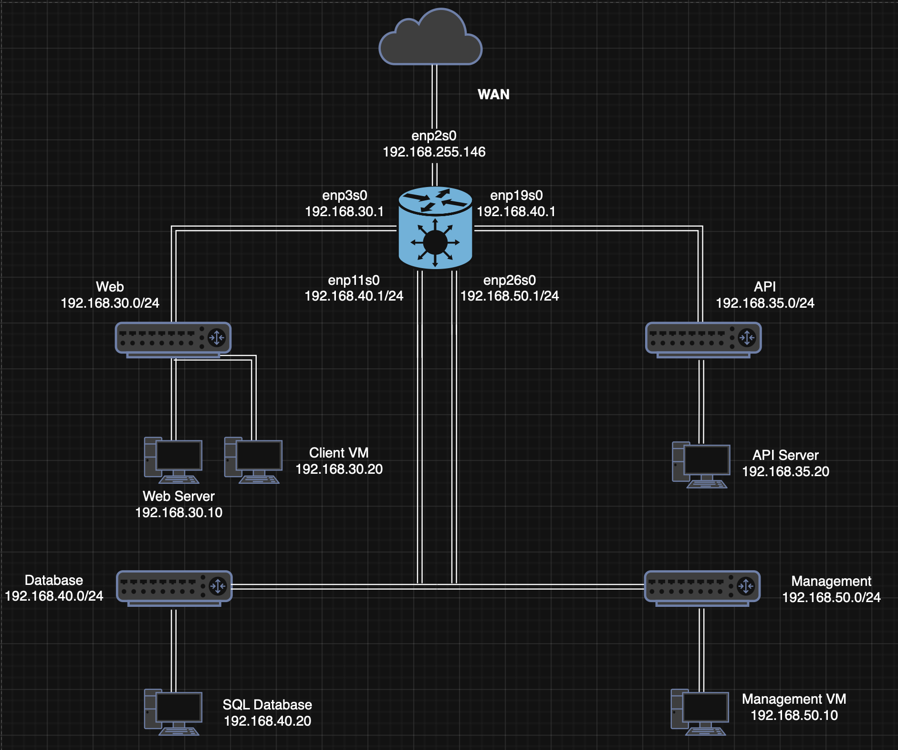

# 📌 Trading System Lab — Multi-Tier Architecture

## 📖 Overview

The **Trading System Lab** is a multi-tier web application built in VMware, simulating an enterprise-style distributed system across segmented virtual networks.

Users can view trading data stored in a PostgreSQL database through a simple web dashboard. When a user clicks **"Load Trades"**, the request travels across multiple isolated network layers before data is returned to the browser — mimicking real production architecture patterns.

**Nginx** acts as the single entry point and reverse proxy, routing traffic to a **Flask API** server, which in turn queries the database. A dedicated management network enables direct administrative SSH access to all VMs.

---

## ⭐ Tech Stack

| Layer          | Technology                        |
|----------------|-----------------------------------|
| Frontend       | HTML, CSS, JavaScript             |
| Web Server     | Nginx (reverse proxy)             |
| Backend        | Python (Flask)                    |
| Database       | PostgreSQL                        |
| Infrastructure | VMware, Isolated Virtual Networks |
| System Tools   | systemd, Linux networking         |

---

## 🎯 Purpose & Demonstrated Competencies

This lab demonstrates practical engineering skills across infrastructure, networking, and application development:

- Designed and deployed a multi-tier distributed system across isolated virtual networks
- Configured PostgreSQL with dedicated users, schemas, and access control policies
- Built and secured an Nginx reverse proxy as a single ingress point for all client traffic
- Developed a REST API in Python (Flask) with structured JSON responses
- Diagnosed and resolved cross-network communication failures in a segmented environment
- Managed Linux service lifecycles using `systemd` across multiple nodes
- Integrated frontend, backend, and database layers into a cohesive production-style system

---

## ➡️ System Flow


1. User opens the web application in the browser
2. User clicks **"Load Trades"**
3. Browser sends a `GET` request to `/api/trades`
4. **Nginx** receives the request on the Web Network
5. Nginx reverse-proxies the request to the Flask API server
6. **Flask** processes the request and queries PostgreSQL
7. **PostgreSQL** returns the requested trading records
8. Flask formats the response as JSON and returns it to Nginx
9. Nginx forwards the response back to the browser
10. The dashboard renders the trading data

---

## 🌐 Network Design

| Network            | Subnet           | Purpose                    | VM(s)                     |
|--------------------|------------------|----------------------------|---------------------------|
| Web Network        | 192.168.30.0/24  | Web server & client access | `web-server`, `Trader-VM` |
| API Network        | 192.168.35.0/24  | Backend application layer  | `app-server`              |
| Database Network   | 192.168.40.0/24  | Data storage layer         | `db-server`               |
| Management Network | 192.168.50.0/24  | Administrative access      | `Management-VM`           |

> Each VM only has network interfaces for the segments it needs — enforcing strict service-to-service communication boundaries.



---

## 🏗️ System Architecture

The system is structured into three main layers:

---

### 🌐 Web Layer — Nginx
Provides a secure interface between external users and internal backend services.

- Serves static frontend files (HTML, CSS, JavaScript)
- Acts as a reverse proxy, routing `/api/*` requests to the Flask API server
- Single entry point for all client traffic — backend infrastructure is never exposed directly

---

### ⚙️ Application Layer — Flask API
Handles all business logic and API functionality.

- Processes requests forwarded from Nginx
- Exposes REST API endpoints (e.g. `GET /api/trades`)
- Queries PostgreSQL and returns structured JSON responses
- Isolated on its own network segment — not reachable directly from clients

---

### 🗄️ Data Layer — PostgreSQL
Stores and manages all trading data.

- Maintains structured trading datasets
- Accessible only via the Flask API server
- Not exposed to the Web Network or external clients
- Enforces data integrity, consistency, and security

---

## 🧠 Key Design Decisions & Security Considerations

- **Network segmentation** — Isolated subnets enforce strict communication boundaries, minimising the attack surface 
- **Single ingress point** — Nginx centralises routing and conceals backend infrastructure from external clients.
- **Database isolation** — The API mediates all database access, preventing direct exposure and lateral movement.
- **Least privilege** — PostgreSQL uses a restricted user granting the API read-only access to relevant tables only.
- **Management network separation** — Administrative SSH access is isolated from application traffic.
- **VM-per-service architecture** — Each service runs on a dedicated VM, eliminating single-point-of-failure risks.
- **systemd service management** — Ensures reliable process control and service persistence across reboots.
---

## 🔮 Future Improvements

- Introduce **load balancing** at the web layer for horizontal scalability
- Enforce **firewall rules** using `iptables` or `nftables` at each network boundary
- Implement **JWT or API key authentication** to restrict API access to authorised clients only
- Containerise services using **Docker** for reproducible deployments and tighter resource isolation
- Introduce **centralised audit logging** to record all API calls, database queries, and admin actions
- Enable **encryption at rest** for the PostgreSQL data volume and **TLS in transit** between all services
- Apply **Role-Based Access Control (RBAC)** to the database and API layers to enforce least-privilege access 
- Deploy **network monitoring and alerting** (e.g. Prometheus + Grafana) to detect anomalous traffic patterns


---

## 📁 Repository Structure

```
trading-system-lab/
├── README.md
├── assets/
│   ├── Architecture.png
│   └── Network-topology.png
├── web-server/
│   ├── README.md
│   ├── nginx.conf
│   ├── trading.conf
│   ├── index.html
│   ├── style.css
│   └── app.js
├── app-server/
│   ├── README.md
│   ├── app.py
│   ├── requirements.txt
│   └── flask-api.service
├── db-server/
│   ├── README.md
│   ├── schema.sql
│   ├── seed.sql
│   └── pg_hba.conf
└── network/
    ├── README.md
    └── network-design.md
```
---

