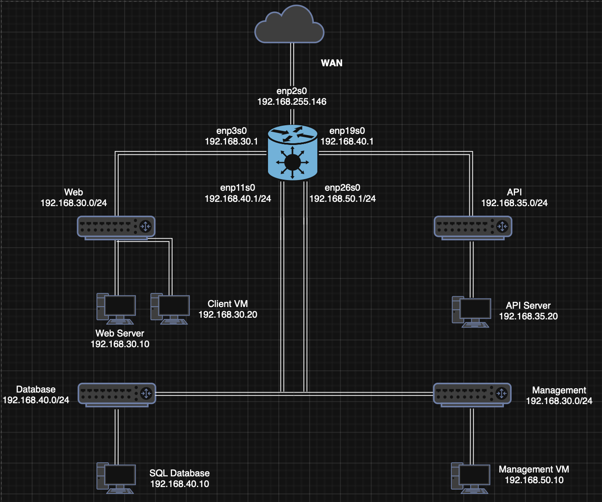

# 📌 Trading System Lab (Multi-Tier Architecture)

## 📖 Overview

The **Trading System Lab** is a multi-tier web application architecture designed to simulate an enterprise-style distributed system using isolated virtual networks.

The system allows users to view trading data stored in a PostgreSQL database through a simple web interface. When a user interacts with the frontend dashboard (e.g., clicking **“Load Trades”**), a request is processed across multiple isolated layers before the data is returned to the browser.

At the core of the system, **Nginx acts as a reverse proxy**, serving as the single entry point for all client traffic while the API routes requests to the backend services.

Each component is deployed on separate virtual machines within isolated networks which replicates a real-world production environment, emphasizing security, scalability, and separation of concerns.

---

## 🎯 Purpose

This lab demonstrates practical skills in:

- Designing and implementing a multi-tier system with separated services across isolated networks
- Network segmentation across virtual machines
- SQL database configuration and access control
- Separation of frontend, backend, and database layers
- API development and integration using **Python**
- Reverse proxy configuration using Nginx
- Service management using `systemd`
- Debugging distributed system issues across multiple nodes

## System Flow

1. User opens the web application in the browser  
2. User clicks **“Load Trades”**  
3. Browser sends a request to `/api/trades`  
4. Nginx receives the request  
5. Nginx forwards it to the Flask API server  
6. Flask processes the request and queries the database  
7. PostgreSQL returns the requested data  
8. API formats and returns JSON response  
9. Browser displays the trading data in the dashboard

---

## 🌐 Network Design

| Network            | Subnet            | Purpose                     |
|------------------|------------------|----------------------------|
| Web Network       | 192.168.30.0/24  | Web server & client access |
| API Network       | 192.168.35.0/24  | Backend application layer  |
| Database Network  | 192.168.40.0/24  | Data storage layer         |
| Management Network| 192.168.50.0/24  | Administrative access      |

## 🏗️ System Architecture

The system is structured into three main layers:

- **Web Layer (Nginx)** – Serves the frontend and handles incoming requests  
- **Application Layer (Flask API)** – Processes business logic and handles API requests  
- **Data Layer (PostgreSQL)** – Stores and manages trading data  

### 🌐 Web Server (Nginx)

- Serves static frontend files (HTML, CSS, JavaScript)
- Acts as a reverse proxy for API requests
- Single entry point for all user traffic
- Forwards requests to backend services securely

---

### ⚙️ API Server (Flask)

- Provides REST API endpoints
- Handles business logic and request processing
- Communicates with the database layer
- Returns structured JSON responses to the frontend

---

### 🗄️ Database Server (PostgreSQL)

- Stores structured trading data
- Not exposed directly to users or external networks
- Accessible only through the API layer and management network
- Ensures data security and integrity

--- 
### 🔁 Reverse Proxy (Nginx)

Nginx is configured as a reverse proxy to route API traffic:
/api --> Flask API Server

## 🧠 Key Design Decisions

The system was designed with a strong focus on modularity, security, and realistic production-like architecture. A multi-tier approach was chosen to separate the Web, Application, and Database layers, ensuring that each component has a clearly defined responsibility. This improves maintainability, scalability, and fault isolation, as changes or failures in one layer do not directly impact the others.

Network segmentation was implemented using separate subnets for each functional layer, including a dedicated management network. This reduces the attack surface and enforces strict control over how services communicate with each other. Only explicitly required traffic is allowed between networks, following a least-privilege communication model.

The PostgreSQL database was intentionally isolated from direct external access to ensure that all data interactions occur through the API layer. This enforces consistent validation and business logic handling, preventing unauthorized or unfiltered access to sensitive data.

Nginx was selected as a reverse proxy to serve as the single entry point into the system. This centralizes request handling, hides backend infrastructure from direct exposure, and simplifies routing between the frontend and API services.

Each service runs on its own virtual machine to simulate a real-world distributed environment. This decision improves isolation between components and provides a more accurate representation of enterprise infrastructure compared to container-only or single-host setups.

All services are managed using systemd to ensure reliability, automatic startup on boot, and consistent service control across the environment. This reflects standard practices in Linux-based production systems.

### Benefits

- Hides backend services from direct exposure  
- Centralizes request routing and control  
- Improves security and maintainability  
- Enables scalable backend architecture

## 🧩 Challenges & Fixes

### ❌ 502 Bad Gateway
- **Issue:** Nginx could not reach the API server  
- **Fix:** Corrected upstream configuration and ensured Flask service was running  

### ❌ API Not Responding
- **Issue:** Flask bound to `127.0.0.1`  
- **Fix:** Updated binding to `0.0.0.0` for network accessibility  

### ❌ Missing Dependencies
- **Issue:** Incomplete Python environment setup  
- **Fix:** Installed required packages and verified virtual environment  

### ❌ systemd Service Failures
- **Issue:** Incorrect unit configuration or startup order  
- **Fix:** Fixed service files and dependencies  

### ❌ Frontend API Errors
- **Issue:** Incorrect API endpoints in JavaScript  
- **Fix:** Corrected request paths and debugged API calls  

---

## 🧠 What I Learned

This project provided hands-on experience with real-world infrastructure and system design concepts, including:

- Building multi-tier distributed architectures  
- Configuring reverse proxies with Nginx  
- Managing Linux services with systemd  
- Debugging cross-network communication issues  
- Designing secure network segmentation  
- Integrating frontend, backend, and database systems  

It also strengthened my ability to troubleshoot complex distributed systems in a structured and systematic way.

---

## 🔮 Future Improvements

- Add authentication (JWT or API keys)
- Implement firewall rules using `iptables` or `nftables`
- Add centralized logging and monitoring (ELK stack)
- Containerize services using Docker
- Introduce load balancing for scalability
- Improve frontend UI/UX design
- Add HTTPS/TLS encryption between services

---

## 📄 Summary

The Trading System Lab demonstrates how a simple web application can evolve into a structured multi-tier distributed system using real-world architecture principles.

By separating services into isolated network layers and deploying them across multiple virtual machines, this project demonstrates key concepts such as scalability, security, maintainability, and infrastructure design.

Overall, it serves as practical experience in building and managing enterprise-style distributed systems.
