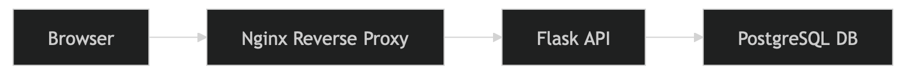

# 📌 Trading System Lab — Multi-Tier Architecture

## 📖 Overview

The **Trading System Lab** is a fully deployed multi-tier web application running in VMware that simulates a production-style distributed system.

When a user clicks **"Load Trades"**, a request is processed end-to-end and returns trading data from a PostgreSQL database to the web dashboard.

The system is built using:
- **Nginx** as a reverse proxy and entry point
- **Flask API** for application logic
- **PostgreSQL** for data storage

Each service runs on a separate virtual network, with controlled communication between layers.

---

## ⭐ Tech Stack

| Layer          | Technology                        |
|----------------|-----------------------------------|
| Frontend       | HTML, CSS, JavaScript             |
| Web Server     | Nginx (reverse proxy)             |
| Backend        | Python (Flask)                    |
| Database       | PostgreSQL                        |
| Infrastructure | VMware, Isolated Virtual Networks |
| System Tools   | systemd, Linux networking         |

---

## ➡️ System Flow



1. User opens the web application (browser)
2. User clicks **"Load Trades"** button on UI
3. Browser sends a `GET` request to `/api/trades`
4. **Nginx** receives the request on the Web Network
5. Nginx reverse-proxies the request to the Flask API server
6. **Flask** processes the request and queries PostgreSQL database
7. **PostgreSQL** returns the requested trading records to Flask API
8. Flask formats the response as JSON and returns it to Nginx
9. Nginx forwards the response back to the browser
10. The dashboard renders the trading data

---
# 🧩 Architecture Style

This system follows a three-tier architecture deployed across insolated virtual networks:

- **Presentation Layer** - (Nginx + Frontend)
- **Application Layer** - (Flask API)
- **Data Layer** - (PostgreSQL)

Each layer is isolated in a separate subnet and communicates only through controlled network paths.

### 🌐 Web Layer — Nginx
Provides a secure interface between external users and internal backend services.
- Serves static frontend files (HTML, CSS, JavaScript)
- Acts as a reverse proxy, routing `/api/*` requests to the Flask API server
- Serves as the single entry point to the system, accessible externally by clients and managemnet VM

---

### ⚙️ Application Layer — Flask API
Handles all application logic
- Exposes REST API endpoints (e.g. `GET /api/trades`)
- Queries PostgreSQL database and returns  JSON responses
- Not directly accessible externally, only from Nginx webserver and managemen tVM

---

### 🗄️ Data Layer — PostgreSQL
Stores structured tarding data
- Not exposed to external networks
- Accessible only via the Flask API server and management VM

---

## 🧠 Key Design Decisions & Security Considerations

- **Single ingress point**: All traffic enters through Nginx
- **Service isolation**: Each tier runs on a separate subnet
- **No direct database access**: API mediates all database queries
- **Least privilege design**: Services only access what they require
- **systemd service management**: Ensures services persist across reboots 
- **Management network separation**: Admin access is isolated from production traffic 
- **Database isolation**: The API mediates all database access, preventing direct exposure

---
## 🎯 Purpose & Demonstrated Competencies

This project demonstrates:

- Managing services using systemd
- Designing a multi-tier distributed system
- Building a REST API using Python and Flask
- Debugging cross-network communication issues
- Implementing reverse proxy routing with Nginx
- Configuring PostgreSQL with secure access controls
- Integrating frontend, backend, and database layers
- Configuring network segmentation in a virtualised environment

---

## 🔮 Future Improvements

- JWT or API **key authentication** 
- **Load balancing** at the web layer
- **TLS encryption** between all layers
- **Conainerise** services using Docker
- Role-Based Access Control **(RBAC)** 
- Centralised **audit logging** (ELK stack)
- Introduce **monitoring** with Prometheus + Grafana

---

## 🔗 Component Documentation

- 🌐 [Web Server](web-server/README.md)
- ⚙️ [API Server](api-server/README.md)
- 🗄️ [Database Server](db-server/README.md)
- 🌐 [Network Design](network/network-design.md)
- 


---

## 📁 Repository Structure

```
trading-system-lab/
├── README.md
├── assets/
│   ├── Architecture.png
│   └── Network-topology.png
├── web-server/
│   ├── README.md
│   ├── default.conf
│   ├── index.nginx-debian.html
│   ├── nginx.conf  
├── api-server/
│   ├── README.md
│   ├── api.service
│   ├── app.py
│   └── requirements.txt
├── db-server/
│   ├── README.md
│   ├── pg_hba.conf
│   ├── postgresql.conf
└── network/
    ├── README.md
    └── network-design.md
```
---

