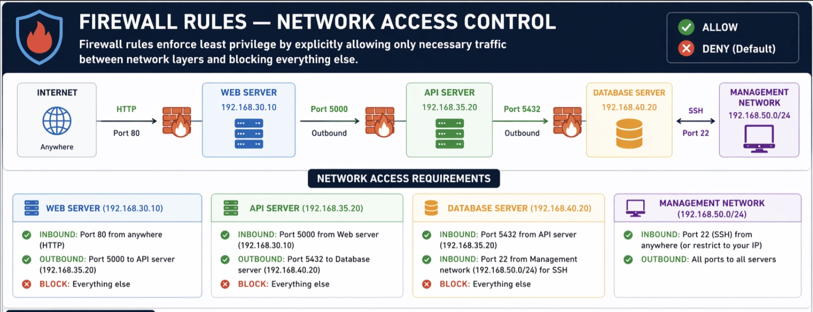

# 🔥 Firewall Rules — Network Access Control

## Overview

Firewall rules enforce **least privilege** by explicitly allowing only necessary traffic between network layers and blocking everything else.



## Network Access Requirements

### Web Server (192.168.30.10)
- **Inbound:** Port 80 from anywhere (HTTP)
- **Outbound:** Port 5000 to API server (192.168.35.20)
- **Block:** Everything else

### API Server (192.168.35.20)
- **Inbound:** Port 5000 from Web server (192.168.30.10)
- **Outbound:** Port 5432 to Database server (192.168.40.20)
- **Block:** Everything else

### Database Server (192.168.40.20)
- **Inbound:** Port 5432 from API server (192.168.35.20)
- **Inbound:** Port 22 from Management network (192.168.50.0/24) for SSH
- **Block:** Everything else

### Management Network (192.168.50.0/24)
- **Inbound:** Port 22 (SSH) from anywhere (or restrict to your IP)
- **Outbound:** All ports to all servers

---

## Threat Model

Without firewall rules:
- ❌ Web server could directly access database (bypasses API security)
- ❌ Any compromised VM can attack any other VM
- ❌ No audit trail of which layer communicated with which

With firewall rules:
- ✅ Web layer isolated from database layer
- ✅ API layer is the only path to data
- ✅ Attack surface is contained if one layer is compromised

---

## Traffic Flow (What Should Be Allowed)

```
Browser                Nginx              Flask API           PostgreSQL
  │                      │                   │                    │
  ├─ HTTP:80 ──→         │                   │                    │
  │                      │                   │                    │
  │                      ├─ tcp:5000 ─→      │                    │
  │                      │                   │                    │
  │                      │                   ├─ tcp:5432 ──→      │
  │                      │                   │                    │
  │                      │        [SQL query executes]             │
  │                      │                   │                    │
  │                      │        ←─ results ─                    │
  │                      │                   │                    │
  │                      ←─ JSON ──────────   │                    │
  │                      │                   │                    │
  ← HTML + JSON ─────────                    │                    │

MGMT <------------------------------------------------------------->
```

Everything else = **BLOCKED**

---

## Why Layer to Layer?

| Scenario | Without Rules | With Rules |
|----------|--------------|-----------|
| Web server compromised | Attacker can query DB directly | Attacker blocked, only has API access |
| API server compromised | Attacker can accept arbitrary commands | Attacker limited to database only |
| Database compromised | Attacker can probe other networks | Attacker can't reach web layer |

